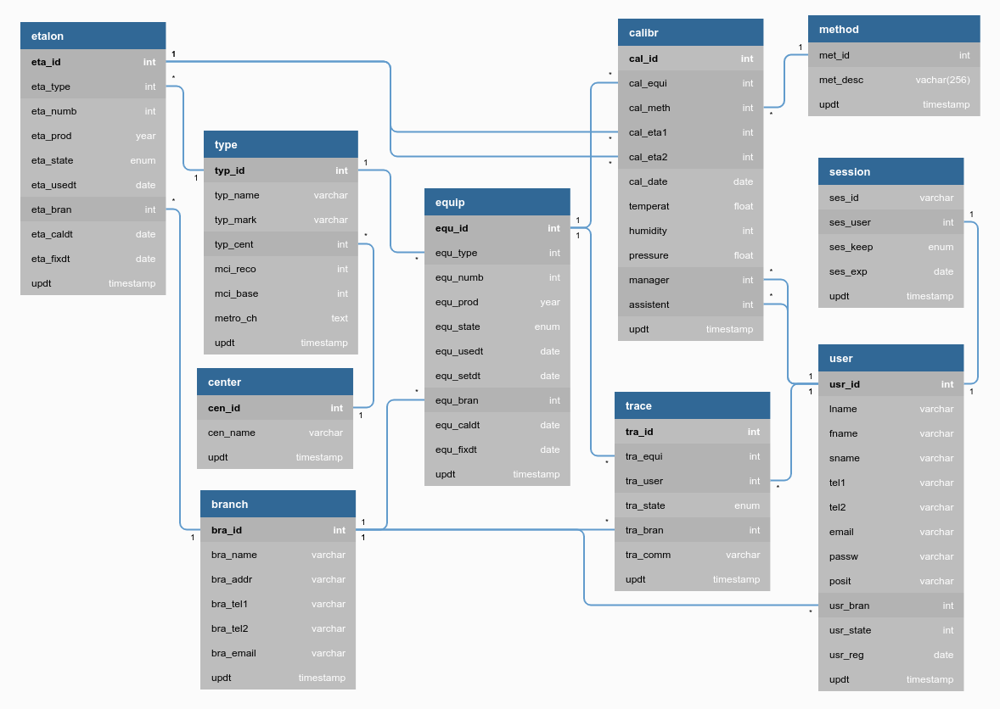

## MetEqDB-desc
**MET**eorological measuring **EQ**uipment **D**ata**B**ase / DB Description

# Опис бази даних
### гідрометеорологічного вимірювального обладнання


## Назва бази даних

`meteqdb` - METeorological measuring EQuipment DataBase - база даних метрологічного вимірювального обладнання

## Структура БД

- [`equip`](#tbl_equip) - таблиця гідрометеорологічного обладнання
- [`etalon`](#tbl_etalon) - таблиця еталонного обладнання
- [`calibr`](#tbl_calibr) - таблиця калібрувань
- [`session`](#tbl_session) - таблиця сесій користувачів

## Схема



<https://dbdiagram.io/> | [Код для побудови діаграми](dbdiagram_code)


## Опис таблиць та їх полів

### user {#tbl_user}

```mysql
CREATE TABLE `user` (
  `usr_id`        int UNSIGNED AUTO_INCREMENT NOT NULL PRIMARY KEY,
  `lname`         varchar(40) NOT NULL DEFAULT '',
  `fname`         varchar(40) NOT NULL DEFAULT '',
  `sname`         varchar(40) NOT NULL DEFAULT '',
  `tel1`          varchar(15) NOT NULL DEFAULT '',
  `tel2`          varchar(15) NOT NULL DEFAULT '',
  `email`         varchar(40) NOT NULL DEFAULT '',
  `passw`         varchar(128) NOT NULL DEFAULT '',
  `posit`         varchar(250) NOT NULL DEFAULT '',
  `usr_bran`      int NOT NULL DEFAULT '0',
  `usr_state`     int NOT NULL DEFAULT '0',
  `usr_reg`       date NOT NULL DEFAULT '2000-01-01 00:00:00',
  `updt`          timestamp NOT NULL DEFAULT CURRENT_TIMESTAMP ON UPDATE CURRENT_TIMESTAMP
)ENGINE=MyISAM;
```

- **usr_id**    - [pk, increment]
- **lname**     - прізвище, (last name)
- **fname**     - ім'я, (first name)
- **sname**     - по батькові, (second name)
- **tel1**      - телефон 1
- **tel2**      - телефон 2
- **email**     - електронна пошта
- **passw**     - пароль
- **posit**     - посада (position)
- **usr_bran**  - підрозділ [ref: > branch.bra_id]
- **usr_state** - стан
- **usr_reg**   - дата реєстрації
- **updt**      - дата оновлення запису


### session {#tbl_session}

```mysql
CREATE TABLE `session` {
  `ses_user`  int unsigned NOT NULL DEFAULT '0',
  `ses_id`    varchar(36) NOT NULL DEFAULT '',
  `ses_keep`  enum(0,1) NOT NULL DEFAULT '0',
  `ses_exp`   date NOT NULL DEFAULT '2000-01-01',
  `updt`      timestamp NOT NULL DEFAULT CURRENT_TIMESTAMP ON UPDATE CURRENT_TIMESTAMP,
--
  UNIQUE `uni_user` (`ses_user`),
)ENGINE=MyISAM;
```

- **ses_id**   - не unique! 0% ймовірності, якщо дві сесії співпадуть, але якщо так, то все одно, береться від конкретного користувача (прикл: `5ab8e472-12d0-4e8d-8c40-db6486403982`)
- **ses_user** - не може бути більше 1 запису для одного користувача, [ref: - user.usr_id]
- **ses_keep** - опція "запам'ятати мене" продовжує дату `ses_exp`, кожний раз при перевірці `ses_id` або логіні (наприклад на 2 тижні), зкидується виходом о з системи, зняття користувачем відповідного прапорця, або по виходу дати в разі неактивності.
- **ses_exp**  - день до якої дійсна сесія (expiration date)
- **updt**     - дата оновлення запису


### etalon {#tbl_etalon}

Таблиця еталонних ЗВТ, які перебувають в експлуатації ЦГО

```mysql
CREATE TABLE `etalon` {
  `eta_id`        int unsigned PRIMARY KEY AUTO_INCREMENT,
  `eta_type`      int
  `eta_numb`      int
  `eta_prod`      year NOT NULL DEFAULT '2000-01-01 00:00:00',
  `eta_state`     enum('O','X') NOT NULL DEFAULT '0',
  `eta_usedt`     date
  `eta_bran`      int
  `eta_caldt`     date
  `eta_fixdt`     date
  `updt`          timestamp
```

- **eta_id**    – id еталона (unsigned int: до 16_777_215)
- **eta_type**  – назва еталона, маркировка > type.typ_id
- **eta_numb**  – заводський номер
- **eta_prod**  – рік випуску
- **eta_state** – Основний `O` / Виведений `X` з експлуатації
- **eta_usedt** – дата введення в експлуатацію (взяття на баланс)
- **eta_bran**  – id метео-станції (замовник) > branch.bra_id
- **eta_caldt** – дата калібрування
- **eta_fixdt** – дата останнього ремонту (коли Виведений з експлуатації то це дата списання)
- **updt**      – дата оновлення


### equip {#tbl_equip}

measuring EQUIPment - вимірювальне обладнання

```mysql
CREATE TABLE `equip` (
  `equ_id`    int PRIMARY KEY AUTO_INCREMENT,
  `equ_type`  int,
  `equ_numb`  int,
  `equ_prod`  year,
  `equ_state` enum('O','P','X'),
  `equ_usedt` date,
  `equ_setdt` date,
  `equ_bran`  int,
  `equ_caldt` date,
  `equ_fixdt` date,
  `updt`      timestamp
);
```

- **equ_id**     – id обладнання (unsigned int: до 16_777_215)
- **equ_type**   – id > назва обладнання, маркировка
- **equ_num**    – заводський номер
- **equ_prod**   – рік випуску
- **equ_state**  – Основний `O` / Резервний `P` / Виведений з експлуатації `X`
- **equ_trace**  – простежуваність до еталону ? - тут, чи у equip? "traceability"
- **equ_branch** – id метео-станції (замовник)
- **equ_usedt**  – дата введення в експлуатацію
- **equ_caldt**  – дата калібрування
- **equ_fixdt**  – дата останнього ремонту
- **equ_setdt**  – дата встановлення на метеостанцію
- **updt**       – дата оновлення


### calibr {#tbl_calibr}

Таблиця еталонних ЗВТ, які перебувають в експлуатації ЦГО

```mysql
CREATE TABLE `calibr` {
  `eta_id`        int unsigned PRIMARY KEY AUTO_INCREMENT,
  `eta_type`      int
```


### session {#tbl_session}

Таблиця лише "живих" сесій. Також сесії (login/logout) синхронно записуються у лог-файл, де і залишаються назавжди.
`login` - записує сесію користувача у цю таблицю, `logout` - видаляє.

```mysql
CREATE TABLE session (
  `ses_id`     varchar(36),
  `ses_user`   smallint(5) unsigned,
  `ses_keep`   enum(1,2),
  `ses_exp`    date,
  `updt`       timestamp,
  UNIQUE (`ses_user`)
);
```
- **ses_id** – id сесії, `12002e8a-6043-4b56-a748-dcf141f7b88f` \
Не unique - неймовірно, якщо співпаде, але якщо так, то все одно, вибираємо запис по користувачу

- **ses_user** – id користувача, починаємо від `1001` \
unique, бо можлива лише одна сесія для одного користувача. Якщо користувач робить `login`, з іншого пристрою - його остання сесія видаляється.

- **ses_keep** – опція "запам'ятати мене", `0` - ні, `1` - так \
При '1' продовжує строк дії сесії на тиждень при кожній перевірці сесії. Зкидується в '0' через тиждень неактивності або `logout`.

- **ses_exp** – дата до якої дійсна сесія, `2022-02-02` \
якщо раніше не станеться `logout`, що видаляє сесію

- **updt** – час оновлення сесії, `2022-01-28 18:30:54` \


---
&copy; 2022, [UHMC](https://meteo.gov.ua/)
